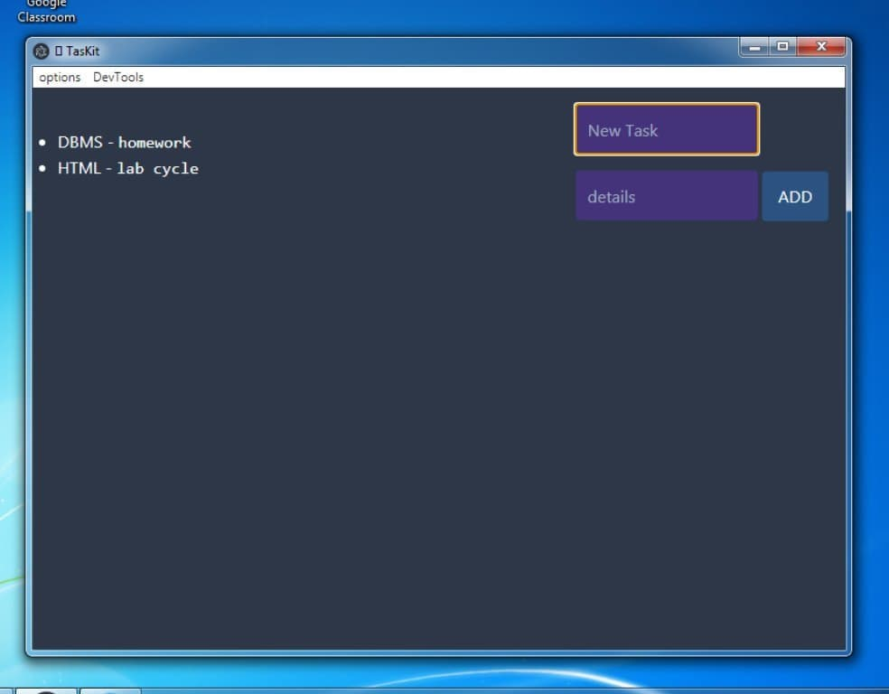
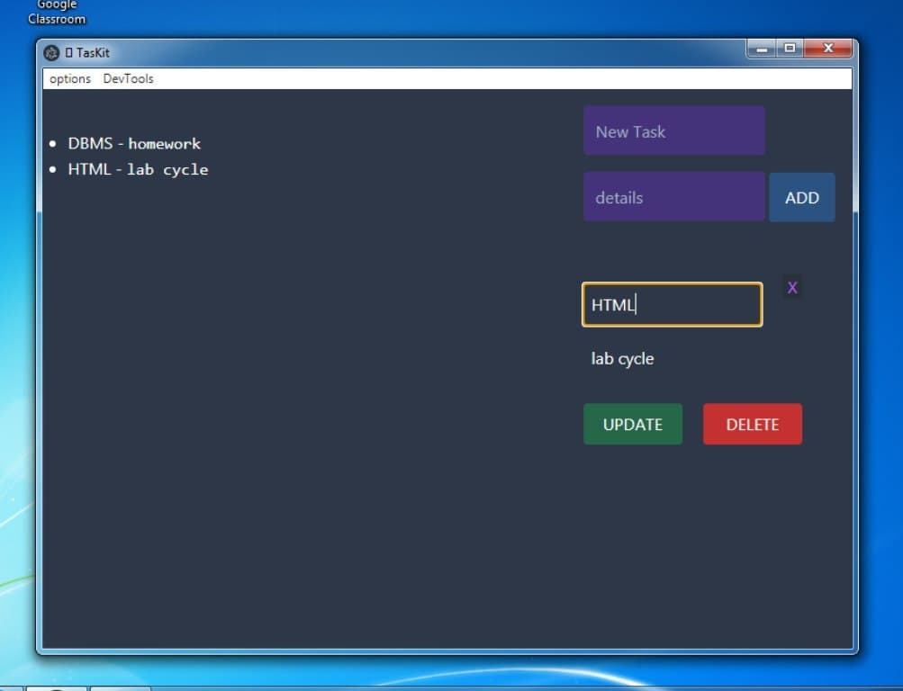

# TasKit
A Todo GUI App written in Electron.js

## GUI Images
- Add new Tasks

    

- Edit and Delete each Task

    

### TODO

  
 Task Notifications 

  - Added, Updated, Deleted noti.
  - ClearAll DB noti

  
 Find more TODO 

  - :joy: :stuck_out_tongue_closed_eyes: :satisfied: :running:

